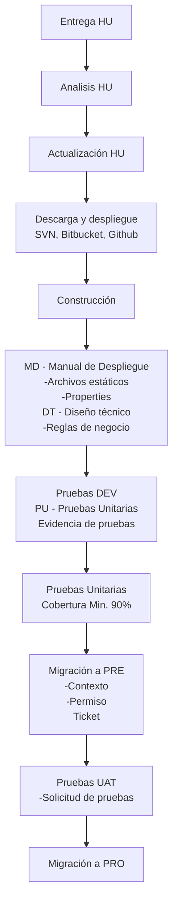
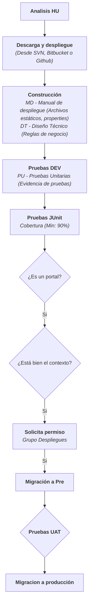

```mermaid
flowchart TD
	A["Entrega HU"]
	-->B["Analisis HU"]
	-->C["Actualización HU"]
	-->D["Descarga y despliegue</br>SVN, Bitbucket, Github"]
	-->E["Construcción"]
	-->F["MD - Manual de Despliegue</br>-Archivos estáticos</br>-Properties</br>DT - Diseño técnico</br>-Reglas de negocio"]
	-->G["Pruebas DEV</br>PU - Pruebas Unitarias</br>Evidencia de pruebas"]
	-->H["Pruebas Unitarias</br>Cobertura Min. 90%"]
	-->I["Migración a PRE</br>-Contexto</br>-Permiso</br>Ticket"]
	-->J["Pruebas UAT</br>-Solicitud de pruebas"]
	-->K["Migración a PRO"]
```

```mermaid
flowchart TB

    A["<b>Analisis HU</b>"]

    -->B["<b>Descarga y despliegue</b></br><i>(Desde SVN, Bitbucket o Github)</i>"]

    -->C["<b>Construcción</b><i></br>MD - Manual de despliegue (Archivos estáticos, properties)</br>DT - Diseño Técnico (Reglas de negocio)"]

    -->D["<b>Pruebas DEV</b><i></br>PU - Pruebas Unitarias (Evidencia de pruebas)"]

    -->E["<b>Pruebas JUnit</b></br><i>Cobertura (Min: 90%)"]

    -->F{¿Es un portal?}

    -->|Si|H{¿Está bien el contexto?}

    -->|Si|G[<b>Solicita permiso</b></br><i>Grupo Despliegues</i>]

    -->|Si|I["<b>Migración a Pre</b>"]

    -->Y{"<b>Pruebas UAT</b>"}

    -->Z["<b>Migracion a producción</b>"]
```