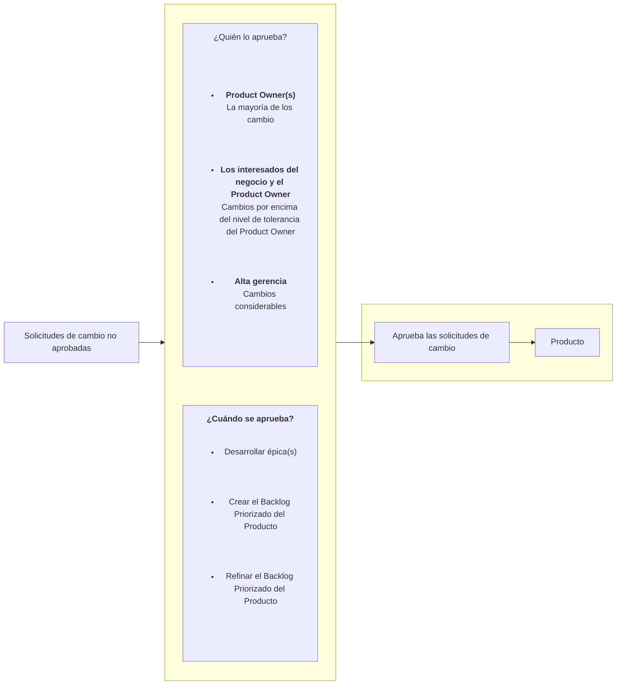

```mermaid
flowchart LR

 subgraph S[" "]

    direction TB

        C["<b>¿Cuándo se aprueba?</b><br><br><ul><li>Desarrollar épica(s)</li>

            <li>Crear el Backlog Priorizado del Producto</li>

            <li>Refinar el Backlog Priorizado del Producto</li>

            </ul>"]

        B["¿Quién lo aprueba?<br><ul>

            <li><b>Product Owner(s)</b><br>La mayoría de los cambio</li>

            <li><b>Los interesados del negocio y el Product Owner</b><br>Cambios por encima del nivel de tolerancia del Product Owner</li>

            <li><b>Alta gerencia</b><br>Cambios considerables</li>

            </ul>"]

  end

 subgraph Z[" "]

    direction TB

        D["Aprueba las solicitudes de cambio"]

        E["Producto"]

  end

    A["Solicitudes de cambio no aprobadas"] --> S

    B ~~~ C

    S --> D

    D --> E
```