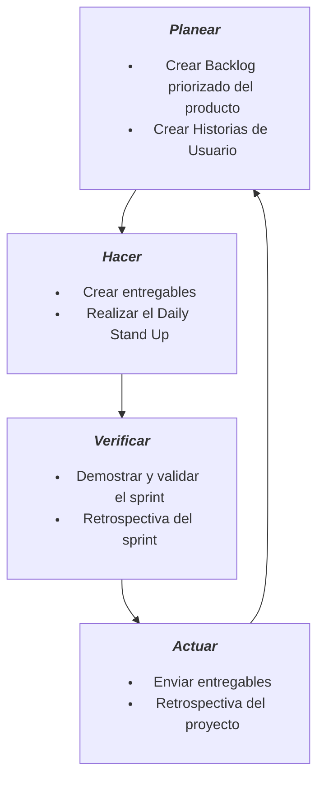

(Ciclo PDCA, por sus siglas en inglés)

```mermaid
        flowchart TB

        Planear["<b><i>Planear</i></b><ul><li>Crear Backlog priorizado del producto</li><li>Crear Historias de Usuario</li></ul>"]-->

        Hacer["<b><i>Hacer</i></b><ul><li>Crear entregables</li><li>Realizar el Daily Stand Up</li></ul>"]-->

        Verificar["<b><i>Verificar</i></b><ul><li>Demostrar y validar el sprint</li><li>Retrospectiva del sprint</li></ul>"]-->

        Actuar["<b><i>Actuar</i></b><ul><li>Enviar entregables</li><li>Retrospectiva del proyecto</li></ul>"]-->Planear
```