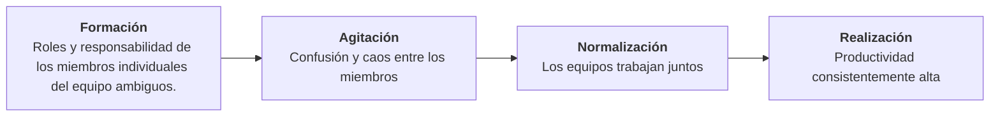

```mermaid
flowchart LR

    A["<b>Formación</b><br>Roles y responsabilidad de los miembros individuales del equipo ambiguos."]-->

    B["<b>Agitación</b><br>Confusión y caos entre los miembros"]-->

    C["<b>Normalización</b><br>Los equipos trabajan juntos"]-->

    D["<b>Realización</b><br>Productividad consistentemente alta"]
```