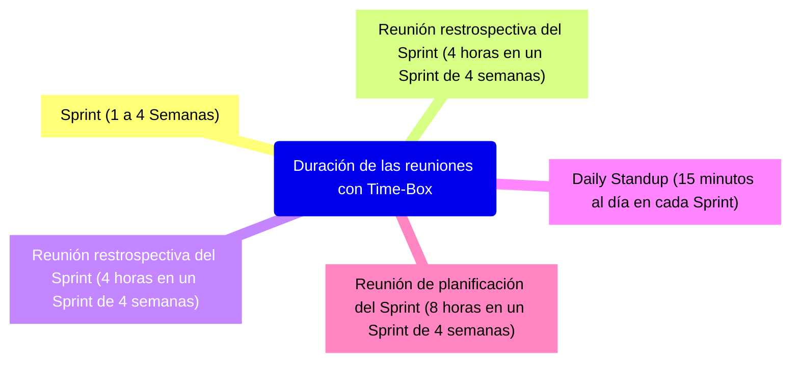

```mermaid
mindmap
  root(Duración de las reuniones con Time-Box)
	  A["Sprint (1 a 4 Semanas)"]
	  B["Reunión restrospectiva del Sprint (4 horas en un Sprint de 4 semanas)"]
	  C["Reunión restrospectiva del Sprint (4 horas en un Sprint de 4 semanas)"]
	  D["Daily Standup (15 minutos al día en cada Sprint)"]
	  E["Reunión de planificación del Sprint (8 horas en un Sprint de 4 semanas)"]
```
