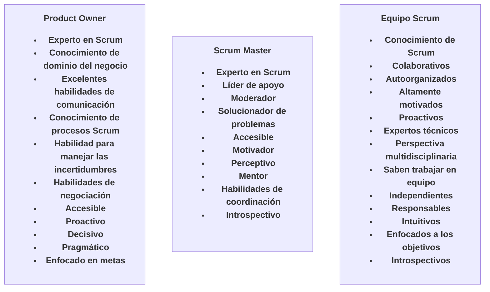

```mermaid
flowchart TD
	PO[<b>Product Owner<ul><li>Experto en Scrum</li><li>Conocimiento de dominio del negocio</li><li>Excelentes habilidades de comunicación</li><li>Conocimiento de procesos Scrum</li><li>Habilidad para manejar las incertidumbres</li><li>Habilidades de negociación</li><li>Accesible</li><li>Proactivo</li><li>Decisivo</li><li>Pragmático</li><li>Enfocado en metas</li></ul>]
	SM[<b>Scrum Master<ul><li>Experto en Scrum</li><li>Líder de apoyo</li><li>Moderador</li><li>Solucionador de problemas</li><li>Accesible</li><li>Motivador</li><li>Perceptivo</li><li>Mentor</li><li>Habilidades de coordinación</li><li>Introspectivo</li><br></ul>]
	ES[<b>Equipo Scrum<ul><li>Conocimiento de Scrum</li><li>Colaborativos</li><li>Autoorganizados</li><li>Altamente motivados</li><li>Proactivos</li><li>Expertos técnicos</li><li>Perspectiva multidisciplinaria</li><li>Saben trabajar en equipo</li><li>Independientes</li><li>Responsables</li><li>Intuitivos</li><li>Enfocados a los objetivos</li><li>Introspectivos</li></ul>]
```