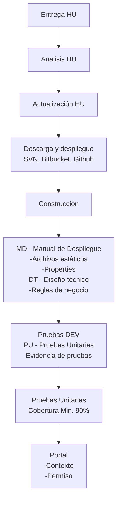

---
- [ ] Entrega HU
- [ ] Análisis HU
	- [ ] Actualización HU
- [ ] Descarga y despliegue
	- [ ]  SVN, Bitbucket, Github
- [ ]  Construcción
	- [ ]  MD - Manual de Despliegue
		- [ ]  Archivos estáticos
		- [ ] Properties
	- [ ]  DT - Diseño Técnico
		- [ ]  Reglas de negocio
- [ ]  Pruebas DEV
	- [ ]  PU - Pruebas Unitarias
		- [ ]  Evidencia de Pruebas
- [ ]  Pruebas JUnit
	- [ ]  Cobertura Min 90%
- [ ]  Portal
	- [ ]  Revisar Contexto
		- [ ]  Revertir si es necesario
	- [ ]  Solicitar Permiso
		- [ ]  Grupo Despliegues
- [ ]  Migración a PRE
- [ ]  Solicitud de Pruebas
	- [ ]  Pruebas UAT
- [ ]  Migración a Producción