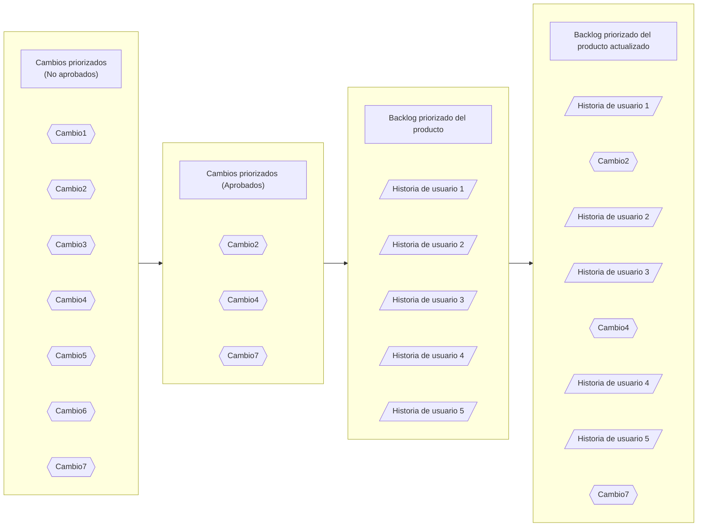

```mermaid
flowchart LR

    A["Cambios priorizados<br>(No aprobados)"]

    B{{Cambio1}}

    C{{Cambio2}}

    D{{Cambio3}}

    E{{Cambio4}}

    F{{Cambio5}}

    G{{Cambio6}}

    H{{Cambio7}}

    I["Cambios priorizados (Aprobados)"]

    J{{Cambio2}}

    K{{Cambio4}}

    L{{Cambio7}}

    M[Backlog priorizado del producto]

    N[/"Historia de usuario 1"/]

    O[/"Historia de usuario 2"/]

    P[/"Historia de usuario 3"/]

    Q[/"Historia de usuario 4"/]

    R[/"Historia de usuario 5"/]

    S["Backlog priorizado del producto actualizado"]

    T[/"Historia de usuario 1"/]

    U{{Cambio2}}

    V[/"Historia de usuario 2"/]

    W[/"Historia de usuario 3"/]

    X{{Cambio4}}

    Y[/"Historia de usuario 4"/]

    Z[/"Historia de usuario 5"/]

    Z1{{Cambio7}}

    subgraph S1[ ]

        direction TB

        A~~~

        B~~~

        C~~~

        D~~~

        E~~~

        F~~~

        G~~~

        H

    end

    subgraph S2[ ]

        I~~~

        J~~~

        K~~~

        L

    end

    subgraph S3[ ]

        M~~~

        N~~~

        O~~~

        P~~~

        Q~~~

        R

    end

    subgraph S4[ ]

        S~~~

        T~~~

        U~~~

        V~~~

        W~~~

        X~~~

        Y~~~

        Z~~~

        Z1

    end

    S1-->S2-->S3-->S4
```