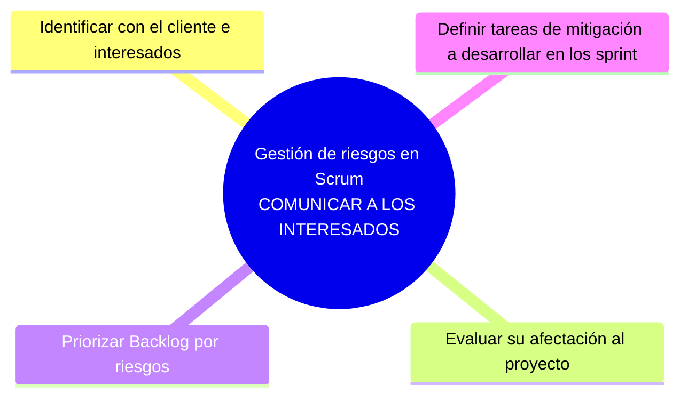

```mermaid
mindmap
  root((Gestión de riesgos en Scrum<br>COMUNICAR A LOS INTERESADOS))

    Identificar con el cliente e interesados

    Evaluar su afectación al proyecto

    Priorizar Backlog por riesgos

    Definir tareas de mitigación a desarrollar en los sprint
```