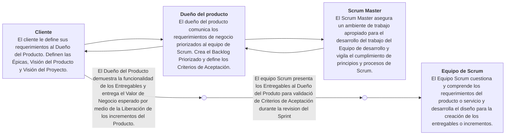

```mermaid
flowchart LR
	C["<b>Cliente</b><br>El cliente le define sus requerimientos al Dueño del Producto. Definen las Épicas, Visión del Producto y Visión del Proyecto."]
	
	PO["<b>Dueño del producto</b><br>El dueño del producto comunica los requerimientos de negocio priorizados al equipo de Scrum. Crea el Backlog Priorizado y define los Criterios de Aceptación."]
	
	SM["<b>Scrum Master</b><br>El Scrum Master asegura un ambiente de trabajo apropiado para el desarrollo del trabajo del Equipo de desarrollo y vigila el cumplimiento de principios y procesos de Scrum."]
	
	ES["<b>Equipo de Scrum</b><br>El Equipo Scrum cuestiona y comprende los requerimientos del producto o servicio y desarrolla el diseño para la creación de los entregables o incrementos."]
	C-->PO
	PO-->SM & C
	SM-->PO
	C-->|"El Dueño del Producto demuestra la funcionalidad de los Entregables y entrega el Valor de Negocio esperado por medio de la Liberación de los incrementos del Producto."|X(( ))
	X-->|"El equipo Scrum presenta los Entregables al Dueño del Produto para validació de Criterios de Aceptación durante la revision del Sprint"|Y
	Y(( ))-->ES
```